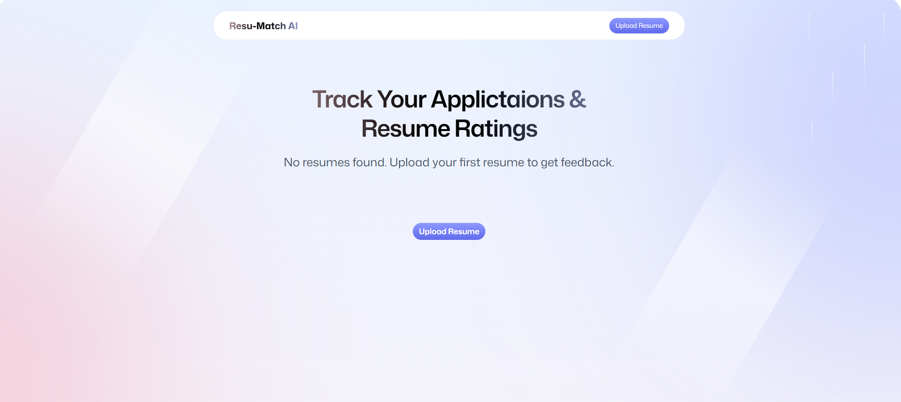
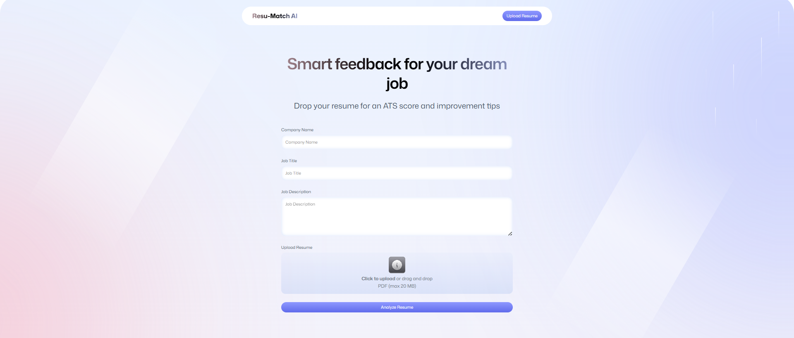
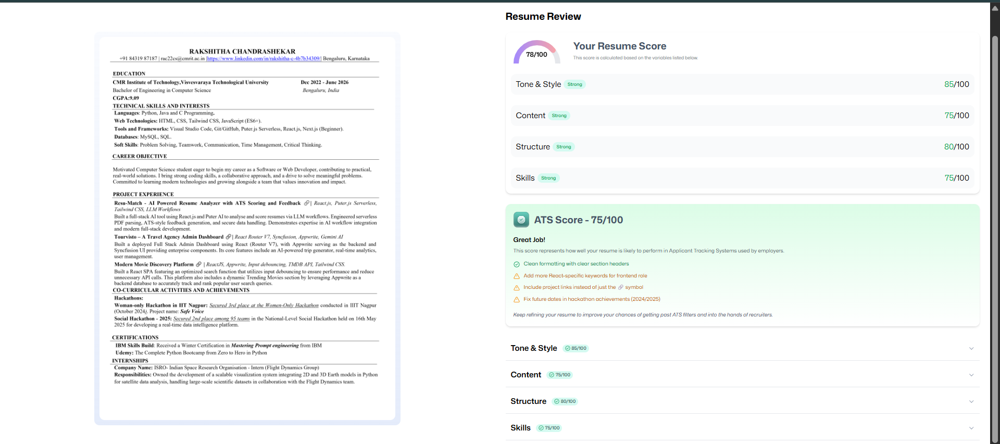

# 🤖 Resu-Match: AI-Powered Applicant Tracking System (ATS) Analyzer  

**Resu-Match** is an enterprise-ready, **serverless AI web application** designed to optimize resumes by simulating an **Applicant Tracking System (ATS)** and providing **AI-driven feedback** against specific job descriptions.  

This project showcases full-stack development, AI integration, and scalable serverless deployment — ideal for modern hiring analytics and resume optimization.

---

## 🌟 Overview  

Modern hiring processes rely heavily on ATS filters that screen resumes before they reach human recruiters.  
**Resu-Match** empowers job seekers by analyzing their resumes against job descriptions using **GPT/Claude-based AI models**, providing:  

- ✅ ATS compatibility scores  
- 🧠 Keyword gap analysis  
- 🗂️ Section-wise actionable feedback  

This end-to-end pipeline highlights real-world AI implementation in a scalable, serverless environment.

---

## 🧰 Tools & Technologies  

| Category | Technology | Purpose |
|-----------|-------------|----------|
| **Frontend** | React.js (Vite), TypeScript | Fast, modular, and type-safe UI development |
| **Styling** | Tailwind CSS V4 | Modern and responsive design framework |
| **State Management** | Zustand | Lightweight and scalable state handling |
| **Backend / Serverless** | Puter.js | Auth, Storage, Database (KV Store), and AI in-browser |
| **AI Models** | GPT / Claude | Resume parsing, scoring, and improvement suggestions |
| **Utilities** | pdfjs-dist | Converts PDF resumes into viewable PNGs |
| **Development Tools** | Git, GitHub, WebStorm | Version control and productivity |

---

## ⚙️ Workflow Summary  

1. **User Authentication:**  
   Secure sign-in using **Puter Auth** for a serverless, identity-managed workflow.  

2. **Resume Upload:**  
   Users upload a **PDF resume** and enter job title, company, and job description.  

3. **AI-Powered Analysis:**  
   - Converts the resume into an image preview.  
   - Sends the file and job data to the **AI engine (GPT/Claude)**.  
   - Receives structured JSON feedback with an **ATS score and improvement areas**.  
   - Stores results in the **Pewter KV database**.  

4. **Dashboard & Insights:**  
   Displays the **ATS score, keyword analysis, and detailed recommendations** across categories like *Tone, Content, Structure,* and *Skills*.  

5. **User History:**  
   Authenticated users can view all previous analyses directly on the homepage.

---

## 📊 Dashboard & Results  

| Feature | Description |
|----------|--------------|
| **ATS Score Gauge** | Displays an overall compatibility score with the job description. |
| **Skills Gap Analysis** | Identifies missing or weak keywords for better alignment. |
| **Structured Feedback** | Categorized insights on tone, structure, and skills. |
| **Interactive Resume Preview** | Click to view full PDF alongside AI suggestions. |

---

## 🖼️ Screenshots  

> Add your screenshots inside a `/images` folder in your project and replace the filenames below.  

### 🔹 Dashboard Overview  
  

### 🔹 Resume Upload Page  
  

### 🔹 AI Feedback & Score Visualization  
  

### 🔹 Skills Gap Analysis Section  
  

---

## ▶️ How to Run  

### **Prerequisites**  
- Node.js (LTS version)  
- Pewter.js account for serverless AI, storage, and auth services  

### **Setup Instructions**  
```bash
# Clone the repository
git clone [YOUR-GITHUB-REPO-URL]
cd ai-resume-analyzer

# Install dependencies
npm install

# Start the development server
npm run dev
